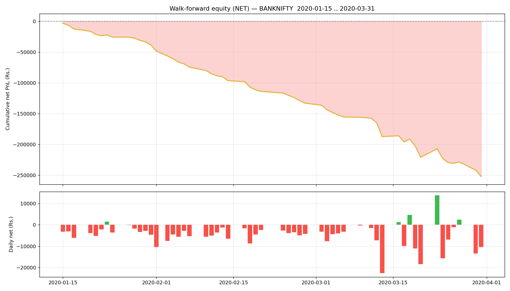

# Walk-forward report — BANKNIFTY

- Generated : 2026-07-06 15:33
- Test span : 2020-01-15 → 2020-03-31 (54 days)
- Train window : 10 days, retrain every 1 day(s)
- Entry/exit thresholds : 0.55 / 0.45, max hold 10 bars
- Label deadband : 0.1%  |  horizon 5m

## Results (net of all costs)
```
  Trades                : 3014  over 54 days
  Win rate              : 39.8%
  Gross PnL             : Rs.-71,485
  Charges               : Rs.180,705
  NET PnL               : Rs.-252,190
  Expectancy / trade    : Rs.-83.7
  Avg win / loss        : Rs.337 / Rs.-362
  Profit factor         : 0.62
  Avg hold              : 4.8 bars
  Max drawdown          : Rs.249,023
  Best / worst day      : Rs.13,793 / Rs.-22,626
  Sharpe (daily, ann.)  : -13.57
  Sortino (daily, ann.) : -16.37

```

## By option type
```
             count            sum
option_type                      
CE            1470 -155642.090174
PE            1544  -96547.989248
```

## Monthly net PnL
```
exit_time
2020-01-31    -38259.836817
2020-02-29    -94728.878355
2020-03-31   -119201.364251
Freq: ME
```

