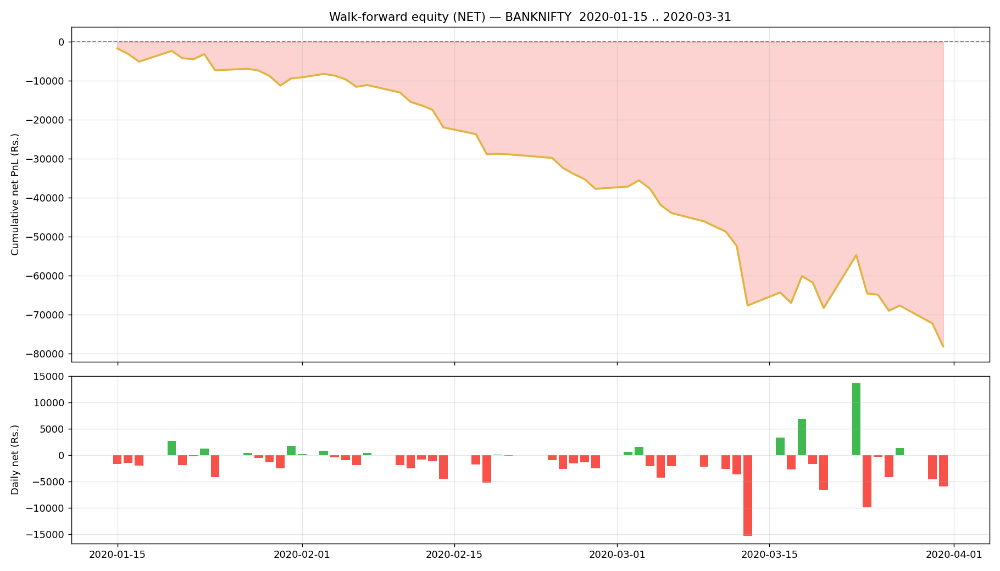

# Walk-forward report — BANKNIFTY

- Generated : 2026-07-06 15:37
- Test span : 2020-01-15 → 2020-03-31 (54 days)
- Train window : 10 days, retrain every 1 day(s)
- Entry/exit thresholds : 0.7 / 0.35, max hold 10 bars
- Label deadband : 0.1%  |  horizon 5m

## Results (net of all costs)
```
  Trades                : 1061  over 54 days
  Win rate              : 44.5%
  Gross PnL             : Rs.-14,556
  Charges               : Rs.63,669
  NET PnL               : Rs.-78,225
  Expectancy / trade    : Rs.-73.7
  Avg win / loss        : Rs.517 / Rs.-547
  Profit factor         : 0.76
  Avg hold              : 8.1 bars
  Max drawdown          : Rs.76,536
  Best / worst day      : Rs.13,601 / Rs.-15,275
  Sharpe (daily, ann.)  : -6.00
  Sortino (daily, ann.) : -8.18

```

## By option type
```
             count           sum
option_type                     
CE             471 -63848.311592
PE             590 -14376.400675
```

## Monthly net PnL
```
exit_time
2020-01-31    -9377.472719
2020-02-29   -28377.815875
2020-03-31   -40469.423672
Freq: ME
```

