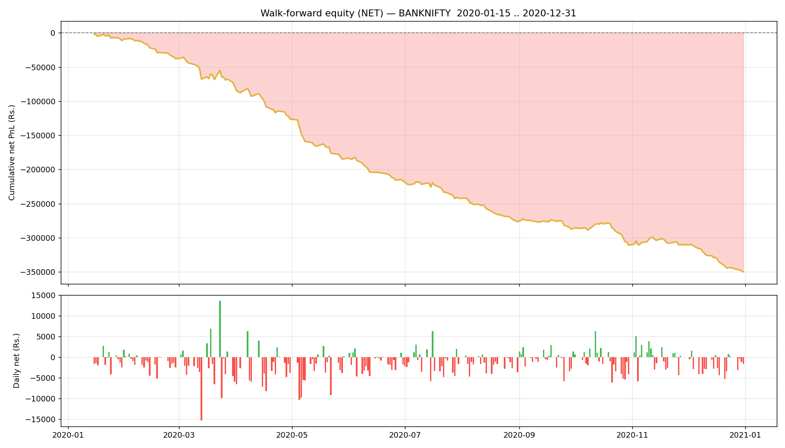

# Walk-forward report — BANKNIFTY

- Generated : 2026-07-06 15:59
- Test span : 2020-01-15 → 2020-12-31 (242 days)
- Train window : 10 days, retrain every 1 day(s)
- Entry/exit thresholds : 0.7 / 0.35, max hold 10 bars
- Label deadband : 0.1%  |  horizon 5m

## Results (net of all costs)
```
  Trades                : 4706  over 241 days
  Win rate              : 45.0%
  Gross PnL             : Rs.-72,379
  Charges               : Rs.277,412
  NET PnL               : Rs.-349,791
  Expectancy / trade    : Rs.-74.3
  Avg win / loss        : Rs.393 / Rs.-456
  Profit factor         : 0.70
  Avg hold              : 8.2 bars
  Max drawdown          : Rs.348,102
  Best / worst day      : Rs.13,601 / Rs.-15,275
  Sharpe (daily, ann.)  : -7.58
  Sortino (daily, ann.) : -10.27

```

## By option type
```
             count            sum
option_type                      
CE            2244 -183957.943588
PE            2462 -165832.714037
```

## Monthly net PnL
```
exit_time
2020-01-31    -9377.472719
2020-02-29   -28377.815875
2020-03-31   -40469.423672
2020-04-30   -47915.420426
2020-05-31   -58255.368483
2020-06-30   -32025.540057
2020-07-31   -25772.520387
2020-08-31   -34318.889876
2020-09-30    -9635.423618
2020-10-31   -24494.092513
2020-11-30      642.636217
2020-12-31   -39791.326216
Freq: ME
```

