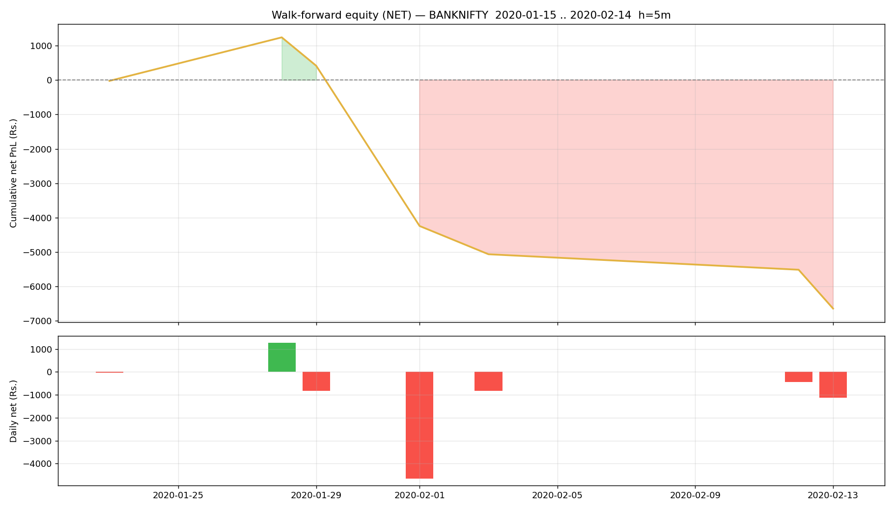

# Walk-forward report — BANKNIFTY

- Generated : 2026-07-06 16:11
- Test span : 2020-01-15 → 2020-02-14 (24 days, 15 skipped by no-edge rule)
- Train window : 10d (fit 8d + cal 2d), retrain every 1d
- Horizon 5m | deadband 0.1% | max hold 10 bars
- Calibrated: True | threshold: auto [0.6, 0.65, 0.7, 0.75, 0.8] | exit 0.45 | skip-no-edge: True

## Results (net of all costs)
```
  Trades                : 40  over 7 days
  Win rate              : 30.0%
  Gross PnL             : Rs.-4,549
  Charges               : Rs.2,091
  NET PnL               : Rs.-6,640
  Expectancy / trade    : Rs.-166.0
  Avg win / loss        : Rs.249 / Rs.-344
  Profit factor         : 0.31
  Avg hold              : 8.2 bars
  Max drawdown          : Rs.7,879
  Best / worst day      : Rs.1,264 / Rs.-4,655
  Sharpe (daily, ann.)  : -8.29
  Sortino (daily, ann.) : -8.97

```

## By option type
```
             count          sum
option_type                    
CE              20 -5601.200614
PE              20 -1038.894225
```

## By chosen entry threshold
```
                 count         sum
entry_threshold                   
0.6                 38 -5369.70025
0.8                  2 -1270.39459
```

## Monthly net PnL
```
exit_time
2020-01-31     413.720783
2020-02-29   -7053.815622
Freq: ME
```

