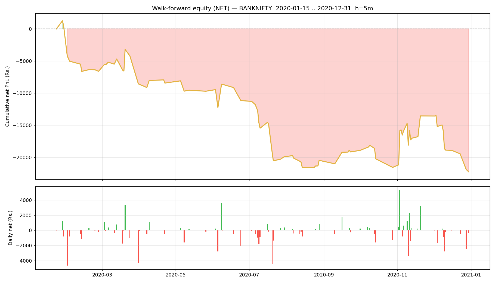

# Walk-forward report — BANKNIFTY

- Generated : 2026-07-06 16:24
- Test span : 2020-01-15 → 2020-12-31 (242 days, 113 skipped by no-edge rule)
- Train window : 10d (fit 8d + cal 2d), retrain every 1d
- Horizon 5m | deadband 0.1% | max hold 10 bars
- Calibrated: True | threshold: auto [0.6, 0.65, 0.7, 0.75, 0.8] | exit 0.45 | skip-no-edge: True

## Results (net of all costs)
```
  Trades                : 470  over 90 days
  Win rate              : 47.7%
  Gross PnL             : Rs.5,225
  Charges               : Rs.27,474
  NET PnL               : Rs.-22,250
  Expectancy / trade    : Rs.-47.3
  Avg win / loss        : Rs.367 / Rs.-424
  Profit factor         : 0.79
  Avg hold              : 7.3 bars
  Max drawdown          : Rs.23,489
  Best / worst day      : Rs.5,330 / Rs.-4,655
  Sharpe (daily, ann.)  : -2.60
  Sortino (daily, ann.) : -3.35

```

## By option type
```
             count           sum
option_type                     
CE             234  -2837.430094
PE             236 -19412.305380
```

## By chosen entry threshold
```
                 count           sum
entry_threshold                     
0.60               296 -11087.492346
0.65                89  -5395.663179
0.70                29  -5525.795051
0.75                24  -1237.870604
0.80                32    997.085706
```

## Monthly net PnL
```
exit_time
2020-01-31     413.720783
2020-02-29   -7040.953741
2020-03-31   -1957.782260
2020-04-30     127.779032
2020-05-31   -1269.218173
2020-06-30   -1453.160320
2020-07-31   -8748.803324
2020-08-31    -553.550995
2020-09-30    1305.586422
2020-10-31   -2402.175527
2020-11-30    8005.527383
2020-12-31   -8676.704754
Freq: ME
```

