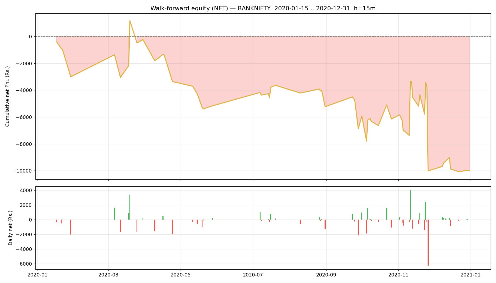

# Walk-forward report — BANKNIFTY

- Generated : 2026-07-06 16:35
- Test span : 2020-01-15 → 2020-12-31 (242 days, 150 skipped by no-edge rule)
- Train window : 10d (fit 8d + cal 2d), retrain every 1d
- Horizon 15m | deadband 0.1% | max hold 30 bars
- Calibrated: True | threshold: auto [0.6, 0.65, 0.7, 0.75, 0.8] | exit 0.45 | skip-no-edge: True

## Results (net of all costs)
```
  Trades                : 276  over 63 days
  Win rate              : 47.8%
  Gross PnL             : Rs.5,710
  Charges               : Rs.15,693
  NET PnL               : Rs.-9,983
  Expectancy / trade    : Rs.-36.2
  Avg win / loss        : Rs.426 / Rs.-460
  Profit factor         : 0.85
  Avg hold              : 13.3 bars
  Max drawdown          : Rs.11,245
  Best / worst day      : Rs.4,032 / Rs.-6,259
  Sharpe (daily, ann.)  : -1.82
  Sortino (daily, ann.) : -2.23

```

## By option type
```
             count           sum
option_type                     
CE             159    523.806599
PE             117 -10507.132298
```

## By chosen entry threshold
```
                 count          sum
entry_threshold                    
0.60               177 -7584.360981
0.65                54  6336.115053
0.70                28 -6245.738502
0.75                 4 -1038.572706
0.80                13 -1450.768562
```

## Monthly net PnL
```
exit_time
2020-01-31   -3005.512817
2020-02-29       0.000000
2020-03-31    2777.777005
2020-04-30   -3132.287050
2020-05-31   -1801.260435
2020-06-30       0.000000
2020-07-31    1525.922782
2020-08-31   -1596.928823
2020-09-30   -1640.862541
2020-10-31     723.553450
2020-11-30   -3863.146695
2020-12-31      29.419426
Freq: ME
```

