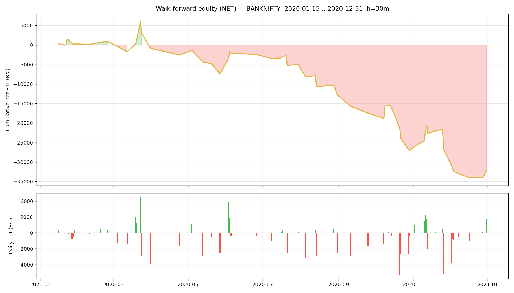

# Walk-forward report — BANKNIFTY

- Generated : 2026-07-06 16:46
- Test span : 2020-01-15 → 2020-12-31 (242 days, 153 skipped by no-edge rule)
- Train window : 10d (fit 8d + cal 2d), retrain every 1d
- Horizon 30m | deadband 0.1% | max hold 60 bars
- Calibrated: True | threshold: auto [0.6, 0.65, 0.7, 0.75, 0.8] | exit 0.45 | skip-no-edge: True

## Results (net of all costs)
```
  Trades                : 236  over 64 days
  Win rate              : 50.0%
  Gross PnL             : Rs.-18,335
  Charges               : Rs.13,936
  NET PnL               : Rs.-32,271
  Expectancy / trade    : Rs.-136.7
  Avg win / loss        : Rs.532 / Rs.-805
  Profit factor         : 0.66
  Avg hold              : 22.4 bars
  Max drawdown          : Rs.40,081
  Best / worst day      : Rs.4,542 / Rs.-5,306
  Sharpe (daily, ann.)  : -4.08
  Sortino (daily, ann.) : -5.69

```

## By option type
```
             count           sum
option_type                     
CE             137 -14729.515323
PE              99 -17541.760728
```

## By chosen entry threshold
```
                 count           sum
entry_threshold                     
0.60                99 -10148.187075
0.65                93 -16879.053425
0.70                17   6815.426100
0.75                12  -4632.170806
0.80                15  -7427.290844
```

## Monthly net PnL
```
exit_time
2020-01-31     304.647453
2020-02-29     629.556220
2020-03-31   -1800.899061
2020-04-30   -1671.749391
2020-05-31   -4866.316067
2020-06-30    4967.120558
2020-07-31   -2584.254498
2020-08-31   -7808.225367
2020-09-30   -4625.786750
2020-10-31   -9624.452838
2020-11-30     206.388550
2020-12-31   -5397.304860
Freq: ME
```

