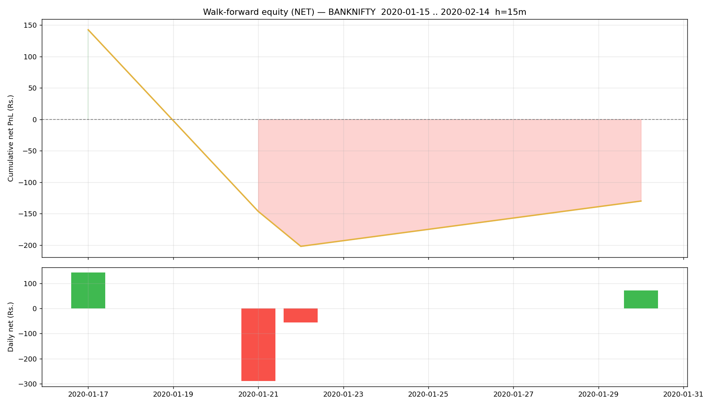

# Walk-forward report — BANKNIFTY

- Generated : 2026-07-06 16:56
- Test span : 2020-01-15 → 2020-02-14 (24 days, 18 skipped by no-edge rule)
- Train window : 10d (fit 8d + cal 2d), retrain every 1d
- Horizon 15m | deadband 0.1% | max hold 30 bars
- Calibrated: True | threshold: auto [0.6, 0.65, 0.7, 0.75, 0.8] | exit 0.45 | skip-no-edge: True

## Results (net of all costs)
```
  Trades                : 11  over 4 days
  Win rate              : 45.5%
  Gross PnL             : Rs.463
  Charges               : Rs.593
  NET PnL               : Rs.-130
  Expectancy / trade    : Rs.-11.8
  Avg win / loss        : Rs.225 / Rs.-210
  Profit factor         : 0.90
  Avg hold              : 11.5 bars
  Max drawdown          : Rs.345
  Best / worst day      : Rs.142 / Rs.-289
  Sharpe (daily, ann.)  : -2.72
  Sortino (daily, ann.) : -3.13

```

## By option type
```
             count         sum
option_type                   
CE               3  106.148840
PE               8 -236.206072
```

## By exit reason
```
             count        mean          sum
exit_reason                                
eod              2 -165.910179  -331.820358
signal           7  146.547015  1025.829105
stop             2 -412.032990  -824.065980
```

## By position size (lots)
```
      count         sum
lots                   
1        11 -130.057233
```

## By chosen entry threshold
```
                 count         sum
entry_threshold                   
0.60                 5  158.997101
0.65                 6 -289.054333
```

## Monthly net PnL
```
exit_time
2020-01-31   -130.057233
Freq: ME
```

