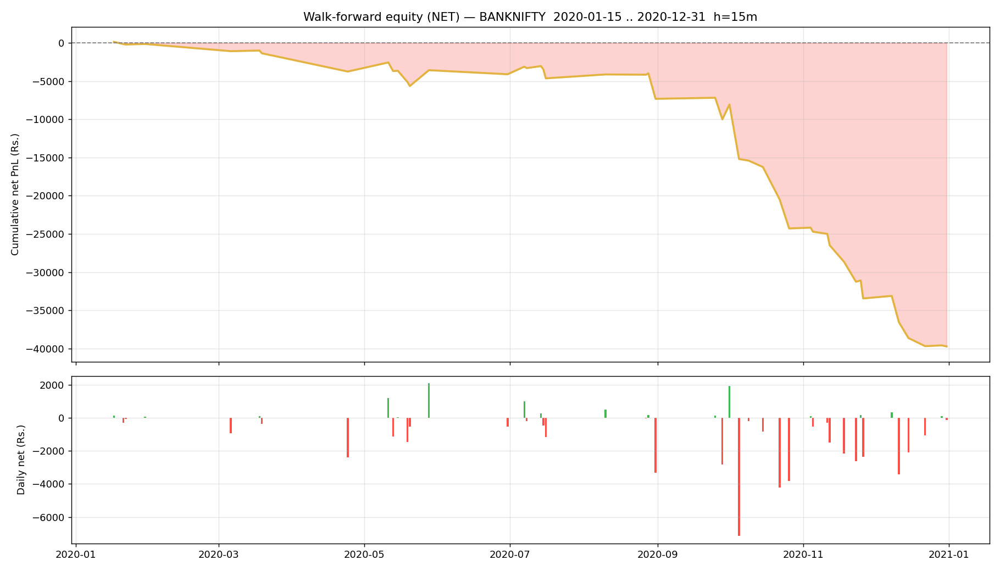

# Walk-forward report — BANKNIFTY

- Generated : 2026-07-06 17:08
- Test span : 2020-01-15 → 2020-12-31 (242 days, 163 skipped by no-edge rule)
- Train window : 10d (fit 8d + cal 2d), retrain every 1d
- Horizon 15m | deadband 0.1% | max hold 30 bars
- Calibrated: True | threshold: auto [0.6, 0.65, 0.7, 0.75, 0.8] | exit 0.45 | skip-no-edge: True

## Results (net of all costs)
```
  Trades                : 144  over 46 days
  Win rate              : 36.1%
  Gross PnL             : Rs.-30,888
  Charges               : Rs.8,845
  NET PnL               : Rs.-39,734
  Expectancy / trade    : Rs.-275.9
  Avg win / loss        : Rs.612 / Rs.-778
  Profit factor         : 0.44
  Avg hold              : 9.7 bars
  Max drawdown          : Rs.39,876
  Best / worst day      : Rs.2,078 / Rs.-7,136
  Sharpe (daily, ann.)  : -8.09
  Sortino (daily, ann.) : -8.50

```

## By option type
```
             count           sum
option_type                     
CE              78 -20847.863769
PE              66 -18886.052596
```

## By exit reason
```
             count         mean           sum
exit_reason                                  
eod              2  -165.910179   -331.820358
signal          55   146.971418   8083.428017
stop            65  -995.975000 -64738.375021
target          10  1586.349766  15863.497663
time            12   115.779444   1389.353334
```

## By position size (lots)
```
      count           sum
lots                     
1        86 -14597.145496
2        40 -15608.922972
3        18  -9527.847898
```

## By chosen entry threshold
```
                 count           sum
entry_threshold                     
0.60                99 -27775.545095
0.65                15  -2714.638449
0.70                15  -3727.066443
0.75                10  -2409.484963
0.80                 5  -3107.181416
```

## Monthly net PnL
```
exit_time
2020-01-31     -130.057233
2020-02-29        0.000000
2020-03-31    -1221.644273
2020-04-30    -2389.580349
2020-05-31      179.251171
2020-06-30     -532.988769
2020-07-31     -536.622820
2020-08-31    -2680.613905
2020-09-30    -2687.962897
2020-10-31   -14285.692257
2020-11-30    -9161.282521
2020-12-31    -6286.722514
Freq: ME
```

