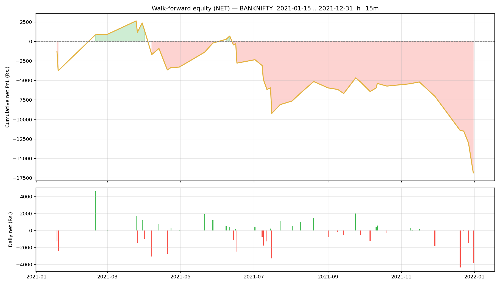

# Walk-forward report — BANKNIFTY

- Generated : 2026-07-06 17:22
- Test span : 2021-01-15 → 2021-12-31 (238 days, 153 skipped by no-edge rule)
- Train window : 10d (fit 8d + cal 2d), retrain every 1d
- Horizon 15m | deadband 0.1% | max hold 30 bars
- Calibrated: True | threshold: auto [0.6, 0.65, 0.7, 0.75, 0.8] | exit 0.45 | skip-no-edge: True

## Results (net of all costs)
```
  Trades                : 167  over 47 days
  Win rate              : 46.1%
  Gross PnL             : Rs.-6,400
  Charges               : Rs.10,463
  NET PnL               : Rs.-16,863
  Expectancy / trade    : Rs.-101.0
  Avg win / loss        : Rs.568 / Rs.-673
  Profit factor         : 0.72
  Avg hold              : 10.7 bars
  Max drawdown          : Rs.19,477
  Best / worst day      : Rs.4,601 / Rs.-4,358
  Sharpe (daily, ann.)  : -3.40
  Sortino (daily, ann.) : -4.80

```

## By option type
```
             count           sum
option_type                     
CE              75 -13406.796341
PE              92  -3456.064103
```

## By exit reason
```
             count         mean           sum
exit_reason                                  
signal          90   256.297342  23066.760736
stop            50 -1023.282567 -51164.128340
target           8  1414.880135  11319.041080
time            19    -4.449154    -84.533920
```

## By position size (lots)
```
      count           sum
lots                     
1       103  -2594.578559
2        45 -20789.320907
3        19   6521.039022
```

## By chosen entry threshold
```
                 count           sum
entry_threshold                     
0.60               107 -10190.150817
0.65                26  -1822.365564
0.70                18  -3224.226833
0.75                10  -1565.944655
0.80                 6    -60.172576
```

## Monthly net PnL
```
exit_time
2021-01-31   -3771.982573
2021-02-28    4600.842853
2021-03-31    1518.235239
2021-04-30   -5645.532997
2021-05-31    3077.989374
2021-06-30   -2572.088944
2021-07-31   -5321.812506
2021-08-31    2958.509414
2021-09-30     -53.803093
2021-10-31    -527.740442
2021-11-30   -1314.549698
2021-12-31   -9810.927071
Freq: ME
```

