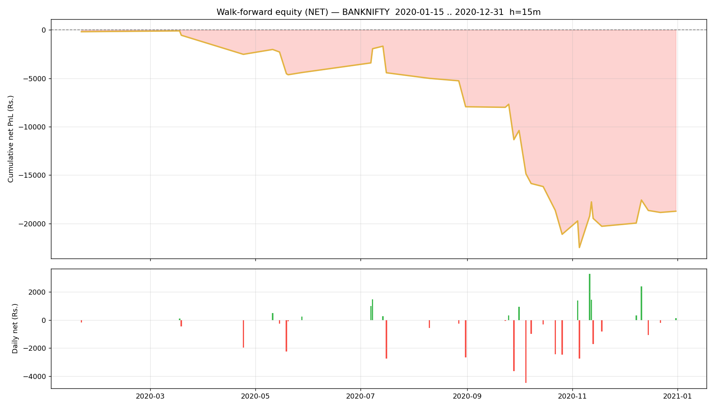

# Walk-forward report — BANKNIFTY

- Generated : 2026-07-06 17:34
- Test span : 2020-01-15 → 2020-12-31 (242 days, 171 skipped by no-edge rule)
- Train window : 10d (fit 8d + cal 2d), retrain every 1d
- Horizon 15m | deadband 0.1% | max hold 30 bars
- Calibrated: True | threshold: auto [0.65, 0.7, 0.75, 0.8] | exit 0.45 | skip-no-edge: True

## Results (net of all costs)
```
  Trades                : 91  over 36 days
  Win rate              : 46.2%
  Gross PnL             : Rs.-13,084
  Charges               : Rs.5,644
  NET PnL               : Rs.-18,728
  Expectancy / trade    : Rs.-205.8
  Avg win / loss        : Rs.639 / Rs.-930
  Profit factor         : 0.59
  Avg hold              : 15.5 bars
  Max drawdown          : Rs.22,383
  Best / worst day      : Rs.3,275 / Rs.-4,478
  Sharpe (daily, ann.)  : -4.92
  Sortino (daily, ann.) : -6.35

```

## By option type
```
             count           sum
option_type                     
CE              54   -346.802050
PE              37 -18380.805175
```

## By exit reason
```
             count         mean           sum
exit_reason                                  
eod              1  -276.260236   -276.260236
signal          46    42.918098   1974.232497
stop             9 -1912.614275 -17213.528474
target          10   862.754493   8627.544926
time            25  -473.583838 -11839.595938
```

## By position size (lots)
```
      count           sum
lots                     
1        49  -2254.877322
2        30 -17537.257494
3        12   1064.527591
```

## By chosen entry threshold
```
                 count           sum
entry_threshold                     
0.65                52  -3017.521866
0.70                19 -14158.964869
0.75                 7    121.871423
0.80                13  -1672.991913
```

## Monthly net PnL
```
exit_time
2020-01-31    -184.369309
2020-02-29       0.000000
2020-03-31    -366.460730
2020-04-30   -1970.102299
2020-05-31   -1880.013299
2020-06-30       0.000000
2020-07-31     -23.089405
2020-08-31   -3512.187084
2020-09-30   -3401.057208
2020-10-31   -9775.386994
2020-11-30     828.909436
2020-12-31    1556.149668
Freq: ME
```

