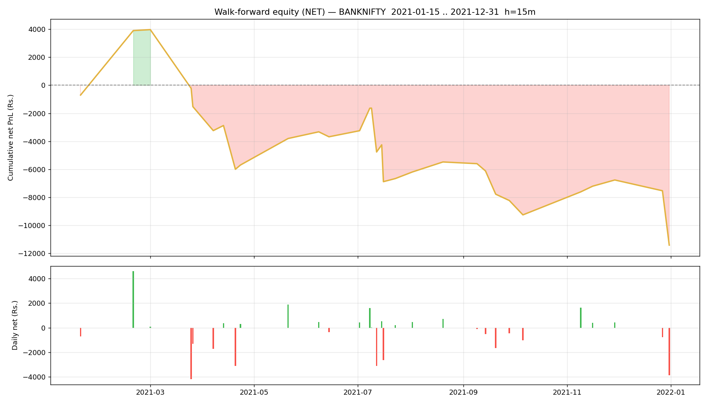

# Walk-forward report — BANKNIFTY

- Generated : 2026-07-06 17:48
- Test span : 2021-01-15 → 2021-12-31 (238 days, 169 skipped by no-edge rule)
- Train window : 10d (fit 8d + cal 2d), retrain every 1d
- Horizon 15m | deadband 0.1% | max hold 30 bars
- Calibrated: True | threshold: auto [0.65, 0.7, 0.75, 0.8] | exit 0.45 | skip-no-edge: True

## Results (net of all costs)
```
  Trades                : 99  over 31 days
  Win rate              : 49.5%
  Gross PnL             : Rs.-5,274
  Charges               : Rs.6,132
  NET PnL               : Rs.-11,405
  Expectancy / trade    : Rs.-115.2
  Avg win / loss        : Rs.554 / Rs.-771
  Profit factor         : 0.70
  Avg hold              : 12.0 bars
  Max drawdown          : Rs.15,372
  Best / worst day      : Rs.4,601 / Rs.-4,191
  Sharpe (daily, ann.)  : -3.25
  Sortino (daily, ann.) : -4.32

```

## By option type
```
             count          sum
option_type                    
CE              47 -6940.021806
PE              52 -4465.108117
```

## By exit reason
```
             count         mean           sum
exit_reason                                  
signal          71   132.433222   9402.758755
stop             7 -2062.663818 -14438.646727
target           5  1480.813698   7404.068492
time            16  -860.831903 -13773.310442
```

## By position size (lots)
```
      count          sum
lots                    
1        63 -9199.791233
2        26 -4484.111282
3        10  2278.772593
```

## By chosen entry threshold
```
                 count          sum
entry_threshold                    
0.65                62 -5258.145693
0.70                18   450.278628
0.75                 9 -2424.669988
0.80                10 -4172.592869
```

## Monthly net PnL
```
exit_time
2021-01-31    -700.581015
2021-02-28    4600.842853
2021-03-31   -5426.456959
2021-04-30   -4163.260227
2021-05-31    1890.047744
2021-06-30     121.659506
2021-07-31   -2980.177337
2021-08-31    1184.776384
2021-09-30   -2749.851664
2021-10-31   -1024.730975
2021-11-30    2489.844195
2021-12-31   -4647.242427
Freq: ME
```

