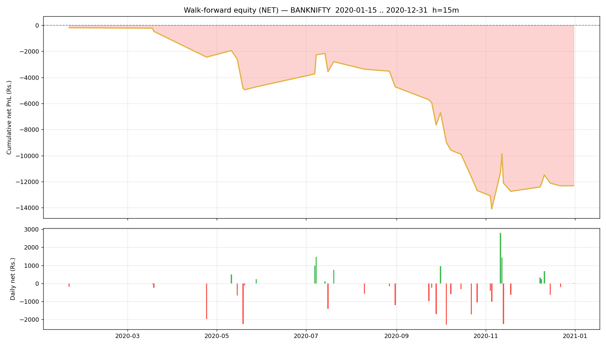

# Walk-forward report — BANKNIFTY

- Generated : 2026-07-06 18:01
- Test span : 2020-01-15 → 2020-12-31 (242 days, 173 skipped by no-edge rule)
- Train window : 10d (fit 8d + cal 2d), retrain every 1d
- Horizon 15m | deadband 0.1% | max hold 30 bars
- Calibrated: True | threshold: auto [0.65, 0.7, 0.75, 0.8] | exit 0.45 | skip-no-edge: True

## Results (net of all costs)
```
  Trades                : 97  over 38 days
  Win rate              : 45.4%
  Gross PnL             : Rs.-6,760
  Charges               : Rs.5,551
  NET PnL               : Rs.-12,311
  Expectancy / trade    : Rs.-126.9
  Avg win / loss        : Rs.429 / Rs.-588
  Profit factor         : 0.61
  Avg hold              : 15.6 bars
  Max drawdown          : Rs.13,912
  Best / worst day      : Rs.2,804 / Rs.-2,286
  Sharpe (daily, ann.)  : -4.63
  Sortino (daily, ann.) : -6.94

```

## By option type
```
             count           sum
option_type                     
CE              55   1389.797482
PE              42 -13700.970327
```

## By exit reason
```
             count         mean           sum
exit_reason                                  
eod              1  -276.260236   -276.260236
signal          47    46.438374   2182.603572
stop            10 -1076.562145 -10765.621445
target          11   585.366030   6439.026335
time            28  -353.247181  -9890.921071
```

## By position size (lots)
```
      count           sum
lots                     
1        97 -12311.172845
```

## By chosen entry threshold
```
                 count          sum
entry_threshold                    
0.65                44  1562.588241
0.70                26 -6868.985081
0.75                 8 -2897.872187
0.80                19 -4106.903817
```

## Monthly net PnL
```
exit_time
2020-01-31    -184.369309
2020-02-29       0.000000
2020-03-31    -284.138111
2020-04-30   -1970.102299
2020-05-31   -2282.190927
2020-06-30       0.000000
2020-07-31    1931.867084
2020-08-31   -1932.524435
2020-09-30   -2929.749609
2020-10-31   -5027.994317
2020-11-30     -62.498658
2020-12-31     430.527737
Freq: ME
```

