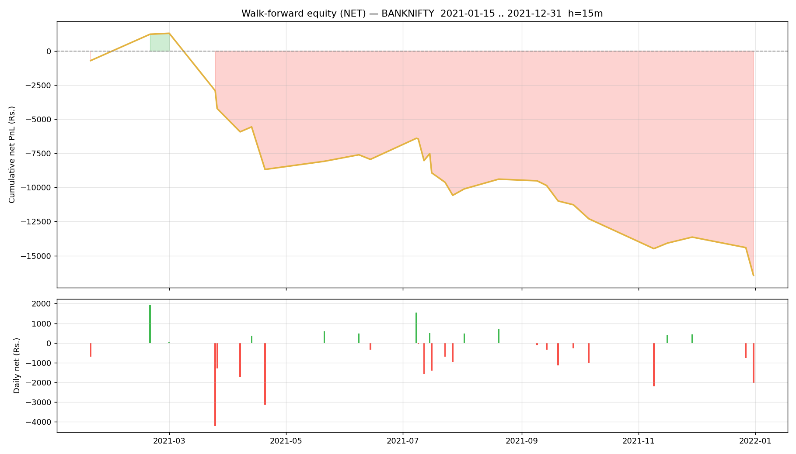

# Walk-forward report — BANKNIFTY

- Generated : 2026-07-06 18:14
- Test span : 2021-01-15 → 2021-12-31 (238 days, 171 skipped by no-edge rule)
- Train window : 10d (fit 8d + cal 2d), retrain every 1d
- Horizon 15m | deadband 0.1% | max hold 30 bars
- Calibrated: True | threshold: auto [0.65, 0.7, 0.75, 0.8] | exit 0.45 | skip-no-edge: True

## Results (net of all costs)
```
  Trades                : 103  over 30 days
  Win rate              : 43.7%
  Gross PnL             : Rs.-10,503
  Charges               : Rs.5,954
  NET PnL               : Rs.-16,456
  Expectancy / trade    : Rs.-159.8
  Avg win / loss        : Rs.371 / Rs.-572
  Profit factor         : 0.50
  Avg hold              : 12.7 bars
  Max drawdown          : Rs.17,755
  Best / worst day      : Rs.1,933 / Rs.-4,212
  Sharpe (daily, ann.)  : -6.64
  Sortino (daily, ann.) : -8.17

```

## By option type
```
             count           sum
option_type                     
CE              50 -11133.513064
PE              53  -5322.782424
```

## By exit reason
```
             count         mean           sum
exit_reason                                  
signal          71    -9.680616   -687.323724
stop             6 -1748.972554 -10493.835325
target           5  1179.927598   5899.637990
time            21  -532.132116 -11174.774428
```

## By position size (lots)
```
      count           sum
lots                     
1       103 -16456.295487
```

## By chosen entry threshold
```
                 count          sum
entry_threshold                    
0.65                70 -5464.053662
0.70                13 -5621.145062
0.75                 8 -1307.243335
0.80                12 -4063.853428
```

## Monthly net PnL
```
exit_time
2021-01-31    -700.581015
2021-02-28    1932.839902
2021-03-31   -5446.804697
2021-04-30   -4467.868713
2021-05-31     598.549248
2021-06-30     138.694311
2021-07-31   -2634.462643
2021-08-31    1184.776384
2021-09-30   -1878.043287
2021-10-31   -1024.730975
2021-11-30   -1346.105637
2021-12-31   -2812.558365
Freq: ME
```

